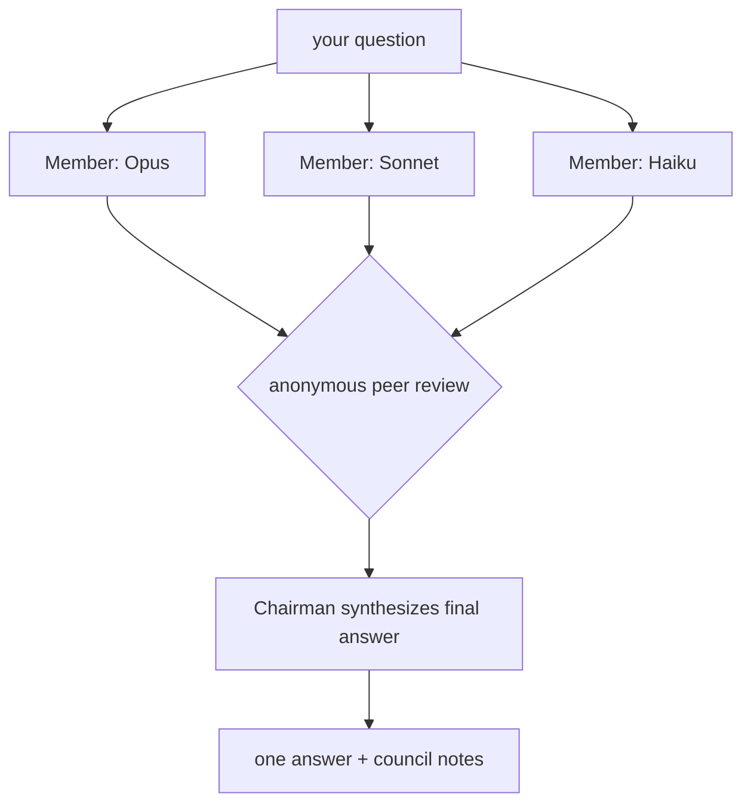

<div align="center">

# 🏛️ LLM Council

### a multi-model deliberation skill for [Claude Code](https://claude.com/claude-code)

ask a question, let a council of models argue it out, get one synthesized answer.

[](./LICENSE)
[](https://claude.com/claude-code)
[](#install)
[](#contributing)

ported from [karpathy/llm-council](https://github.com/karpathy/llm-council)

</div>

---

## what is this

karpathy's original llm-council is a little web app that sends your question to a bunch of models,
has them review each other, and picks a final answer. cool idea, but it needs a server and an
OpenRouter key.

this is that same idea rebuilt as a native Claude Code skill. no web app, no api key, no server.
it just runs inside Claude Code using subagents on different models.

## how it works

three stages, same spirit as the original:



1. **collect.** your question gets fanned out to 3 council members in parallel, each on a
   different model (Opus / Sonnet / Haiku) so the reasoning actually diverges instead of
   three copies agreeing with each other.
2. **review.** each member gets shown all three answers, anonymized and shuffled, and ranks
   them. anonymity is the whole trick. nobody knows which answer is their own, so the critique
   stays honest.
3. **chairman.** a final model reads everything (the answers plus the reviews) and writes the
   one answer the council would actually stand behind, fixing whatever the reviewers caught.

best for the hard, open-ended, or high-stakes stuff where a second (and third) opinion is worth it.

## install

### macOS / Linux

one-liner:

```bash
curl -fsSL https://raw.githubusercontent.com/joppe2001/llm-council-skill/main/install.sh | bash
```

or from a clone:

```bash
git clone https://github.com/joppe2001/llm-council-skill.git
cd llm-council-skill
chmod +x install.sh
./install.sh
```

### Windows (PowerShell)

one-liner:

```powershell
irm https://raw.githubusercontent.com/joppe2001/llm-council-skill/main/install.ps1 | iex
```

or from a clone:

```powershell
git clone https://github.com/joppe2001/llm-council-skill.git
cd llm-council-skill
powershell -ExecutionPolicy Bypass -File .\install.ps1
```

both installers drop `SKILL.md` into `~/.claude/skills/llm-council/` (on Windows that's
`%USERPROFILE%\.claude\skills\llm-council\`), which makes it a global skill you can use in
every project.

### manual

if you'd rather not run a script, just copy `skills/llm-council/SKILL.md` to
`~/.claude/skills/llm-council/SKILL.md` yourself. that's the whole install.

## usage

start a fresh Claude Code session (skills load at startup), then either use the slash command:

```
/llm-council should I use Postgres or SQLite for a local-first desktop app?
```

or just say it normally:

```
convene the council on: <your question>
ask the llm council whether ...
run a council on this decision
```

## tuning

you can steer it in plain english:

| you want | say something like |
| --- | --- |
| best possible answer | "run an all-Opus council" |
| fast and cheap | "quick sonnet/haiku council" |
| bigger panel | "run a 5-member council" |
| no peer review, just answers | "skip the review, just give me the parallel answers" |

> heads up: a full run fires off several subagents (3 answers + 3 reviews + 1 chairman), so it
> burns more tokens than a normal reply. save it for questions that actually deserve a council.

## repo layout

```
.
├── README.md
├── LICENSE
├── install.sh                     # macOS / Linux installer
├── install.ps1                    # Windows installer
└── skills/
    └── llm-council/
        └── SKILL.md               # the skill itself
```

## faq

**do i need an api key?** no. it runs on the models you already have in Claude Code.

**does it work on the free plan?** it works wherever Claude Code subagents and model overrides
work. lighter councils (haiku-heavy) keep the cost down.

**why is the repo public?** the one-liner installers pull raw files from github, which needs the
repo to be public. if you want it private, use the `git clone` install method instead.

**i edited the skill, why didn't the repo update?** the installed copy in `~/.claude/skills/`
and this repo are separate. edit here and reinstall, or symlink them if you want one source of truth.

## contributing

prs welcome. if you've got a better prompt for the chairman, a cleaner installer, or a smarter
default council, open one.

## credits

the council concept and the three-stage process are [Andrej Karpathy's](https://github.com/karpathy/llm-council).
this repo is an unofficial port of that idea to the Claude Code skill format.

## license

[MIT](./LICENSE)
